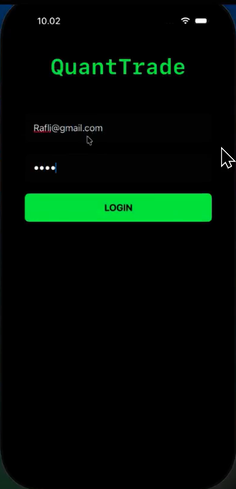
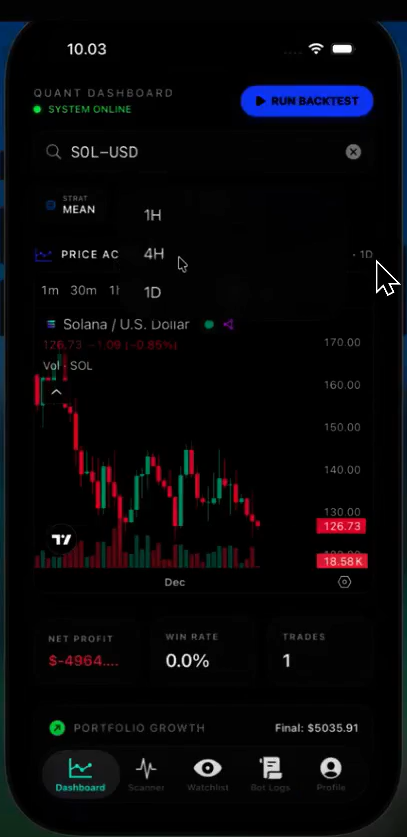
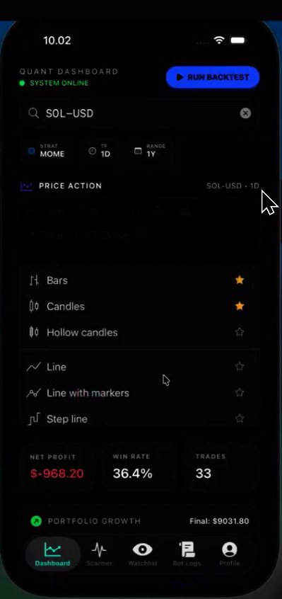
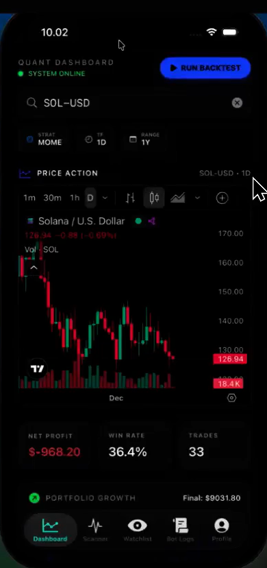
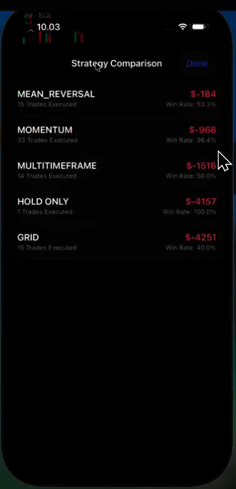
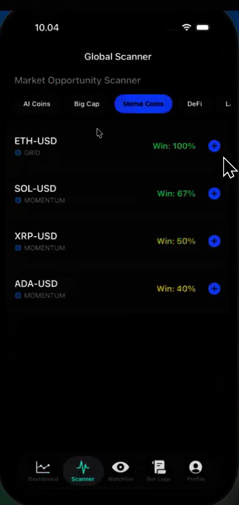
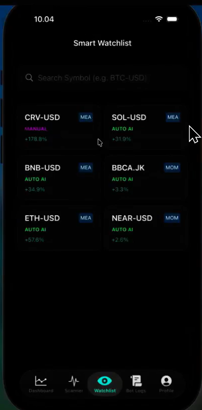
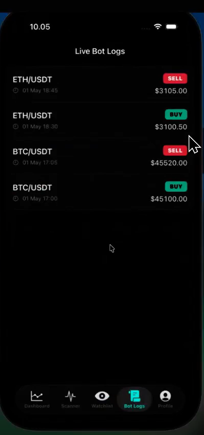
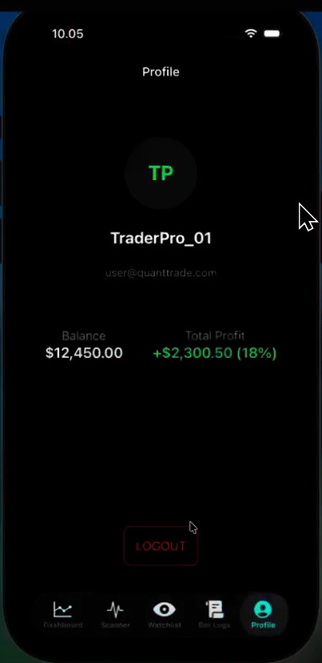

# QuantIOS - Native Mobile Quantitative Analysis 📱


**QuantIOS** is a native iOS application designed for high-level quantitative trading analysis. It bridges complex Python-based trading logic (Backend) with a responsive, elegant mobile interface built in SwiftUI.

Unlike typical cloud-heavy systems, this project utilizes an efficient **File-Based Database Architecture (JSON & CSV)**, enabling fast local data processing and portable data structures.

---

## 📸 App Gallery

Here is a comprehensive tour of the mobile application interface.

*(Screenshots represent the actual iOS Simulator environment)*

<div align="center">
  <!-- Baris 1: Login & Onboarding -->
  
  
  
</div>
<br>
<div align="center">
  <!-- Baris 2: Charts & Strategy -->
  
  
  
</div>
<br>
<div align="center">
  <!-- Baris 3: Logs & Profile -->
  
  
  
</div>

---

## 🛠️ Tech Stack

| Layer | Technology | Role |
| :--- | :--- | :--- |
| **Mobile Frontend** | **SwiftUI** | Modern, gesture-driven native iOS interface. |
| **Backend API** | **FastAPI (Python)** | REST API bridging market data to the iOS app. |
| **Database** | **JSON & CSV** | `watchlist.json` for config, `trades_log.csv` for history. |
| **Data Analysis** | **Pandas & Pandas_TA** | Calculating technical indicators (SMA, Bollinger Bands). |
| **Persistence** | **Core Data** | Offline storage for user sessions and preferences. |
| **Networking** | **URLSession** | Handling async data communication. |

---

## 🌟 Key Features

1.  **Real-time Watchlist:** Synchronizes favorite coins directly to `watchlist.json` on the server.
2.  **Technical Strategy Engine:** Executes Momentum, Mean Reversal, and Grid strategies via `strategy_core.py`.
3.  **iOS Native Charts:** Visualizes price action using Swift Charts and TradingView integration.
4.  **Trade Logging:** Auto-records every simulation into CSV files for long-term performance analysis.
5.  **Biometric Auth:** Secure access using native iOS FaceID/TouchID.

---

## 🏗️ System Architecture

1.  **Python Engine** fetches market data via Yahoo Finance API.
2.  Analysis results are stored in **JSON** and served via **FastAPI**.
3.  **Swift Frontend** fetches data via `APIService.swift`.
4.  Data is parsed into **Swift Models** (`Models.swift`) and rendered via **SwiftUI**.

---

## 📂 Database Structure (File-Based)

* `watchlist.json`: Stores strategy config per coin (Symbol, Mode, Timeframe).
* `trades_log.csv`: Records transaction details (Entry Price, TP, SL, PnL).
* `summary_metrics.json`: Stores cumulative statistics (Win Rate, Total Profit).

---

## 💻 How to Run

### A. Backend Setup (Python)
1.  Navigate to backend folder: `cd Quant-Backend/backend`
2.  Install dependencies:
    ```bash
    pip install -r requirements.txt
    ```
3.  **Run Local Server (Important):**
    ```bash
    python -m uvicorn main:app --reload --host 0.0.0.0 --port 8000
    ```
    > **Note:** Ensure your IPv4 address in `APIService.swift` matches your machine's local IP (check via `ipconfig` on Windows or `ifconfig` on Mac).

### B. Frontend Setup (iOS)
1.  Open `QuantTradeiOS.xcodeproj` in **Xcode**.
2.  Open `APIService.swift` and verify the `baseURL` matches your server's IP.
3.  Select a Simulator (e.g., iPhone 15) and press **Run (Cmd + R)**.

---

## ⚠️ Learning Outcomes & Troubleshooting

* **Data Parsing:** Successfully handled complex type conversion between Python Dictionaries and Swift Decodable Models.
* **Concurrency:** Managed asynchronous calls in iOS to ensure the UI remains buttery smooth while fetching heavy market data.
* **File Handling:** Engineered race-condition-safe JSON reading/writing mechanisms in the backend.

## 👤 Author
**Raflyandi Alviansyah**
